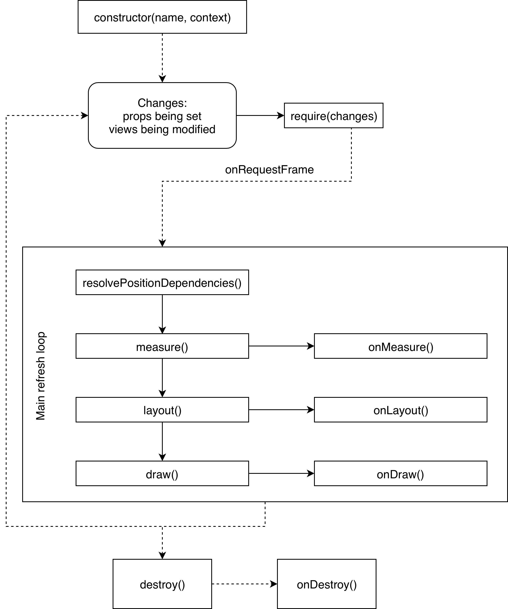
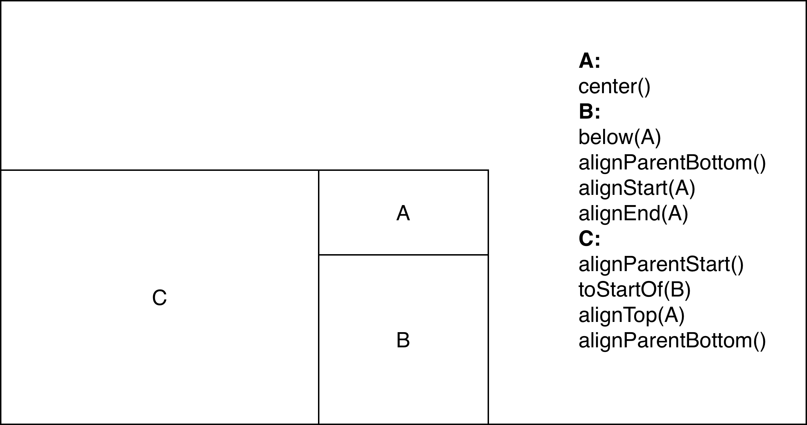

# Kanva

Draw on canvas using views. Should work in both Node.js and browser.
Inspired by Android RelativeLayout mechanisms.

## Examples of use

1. Clone this repo.
2. Make sure the following (3.) command passes. If not you may need to change Node.js version. You can do it by running `nvm use 11.15` once you install `nvm` and install 11.15 with `nvm install 11.15`.
3. `yarn`
4. `yarn start` to launch storybook

Storybook examples are located in `kanva/packages/example/src/stories`.

### `@kanva/core`

A layout and view system that draws stuff on canvas, has no external dependencies besides TypeScript typings (for now :wink: ).
The idea is similar to what we can do with [RelativeLayout](https://developer.android.com/guide/topics/ui/layout/relative) (or ConstraintLayout) and Views on Android. Base classes are:

#### View

It's like component in React. It has it's own lifecycle and is able to accept properties. To access properties from React wrapper, properties need to have Java-style setters and getters (i.e. for property `myProperty`, you have `setMyProperty()` and `getMyProperty()`). Usually we want to see the change after setting a value, this is why view needs to call `require()` method inside property setters.

The lifecycle looks like this:

#### LayoutParams

This is what lets us position the view inside another view. One can set the LayoutParams' values by chaining available methods. The dimensions of View can be set as a number (in pixels), `MATCH_PARENT` or `WRAP_CONTENT`. The calculated size is then wrapped to `minWidth`/`maxWidth` and `minHeight`/`maxHeight`.

- `MATCH_PARENT` - the view is as big as it's parent
- `WRAP_CONTENT` - view takes the smallest amount of space possible

Views can be positioned absolutely or relatively. Absolute positioning is the simplest one: just set the desired `x` and `y` coordinates and view will appear there. Relative positioning is a bit more complex concept, illustrated below.

### `@kanva/react`
React wrappers for Core. Exports:
- Base `Kanva` component (which creates the `RootCanvasView` and manages it's children).
- `View` component
- `TextView` component
- `createReactView()` that wraps a View in React component.
